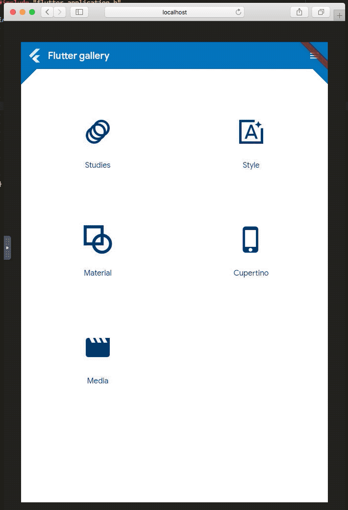

Based on https://github.com/chinmaygarde/fluttercast

Flutter Cast
============

A Flutter Embedder that talks RFB.

Getting Started
---------------

* Linux only.
* On `ubuntu:latest`, get `libvncserver-dev`

Build:

mkdir build
cmake ..
make

Run:
./fluttercast <appdir>

Build application in debug mode, appdir is the root of application directory (with build subdirectory)
